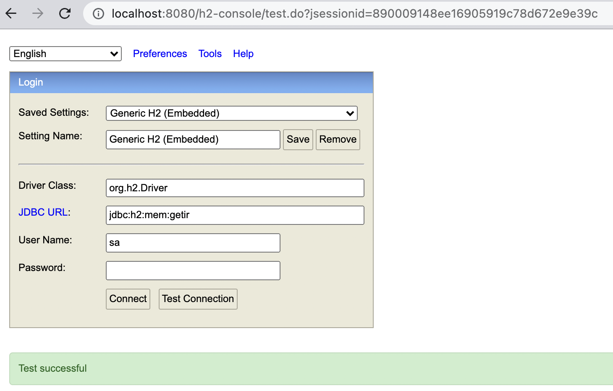
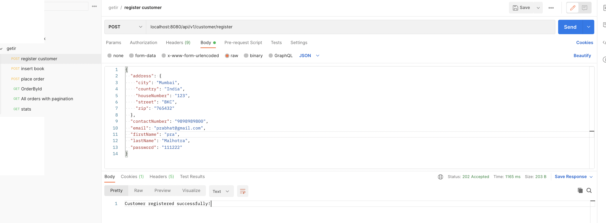

# ReadingIsGood Project

## Steps to run project
- Clone the repo - `git clone https://github.com/malhotra1432/getir.git`
- Build the project - `./go clean build`
- Run the project - `./go bootRun`
- Once the project starts. It will connect to H2 DB In Memory database.
- Access the database by [url](http://localhost:8080/h2-console)

## Steps to access Database
- Click on the above mentioned link and it will show a UI like below

- Mention the config as shown in the image above

## Steps to execute APIs
- Import APIs with postman collection with [this link](getir.postman_collection.json)
- It will appear in postman as below
  

## APIs description
- `localhost:8080/api/v1/customer/register` 
  - To register a customer
  - Email is unique field
- `localhost:8080/api/v1/book/create`
  - To insert a book stock (Only one book at a time for now)
- `localhost:8080/api/v1/order/create`
  - To place an order
  - Every time an order is placed, particular book is deleted
- `localhost:8080/api/v1/order/3`
  - Find an order by id
  - Get the id from db
- `localhost:8080/api/v1/order/email/prabhat@gmail.com?page=0&size=2`
  - To get order by email with pagination
  - Pass page and size as per data in db to enjoy pagination
- `localhost:8080/api/v1/order/stats/prabhat@gmail.com`
  - To get customer's monthly stats
  - Please edit data (created_at field) in db with different months to see stats of more than one month

## Commands
- `./go clean build`   - To clean and build project
- `./go bootRun`       - To run project
- `./go build`         - To build project
- `./go test`          - To run unit and integration tests
- `./go`              - To list out all commands

# Links
- [Swagger Docs](http://localhost:8080/swagger-ui/index.html)
- [H2 DB](http://localhost:8080/h2-console)
- [Postman Collection](getir.postman_collection.json)
